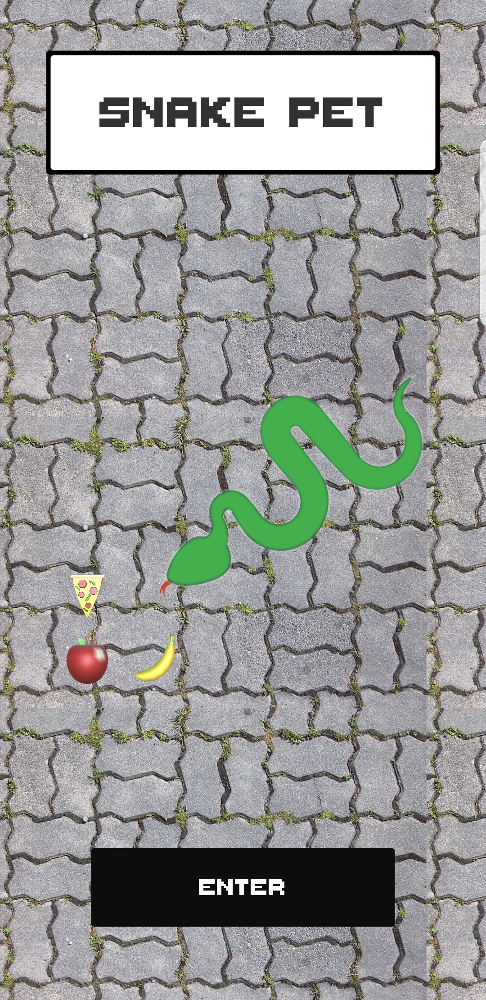
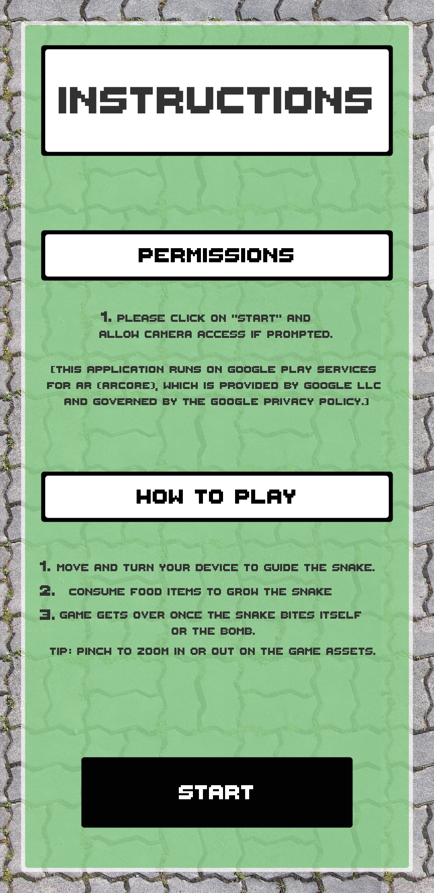
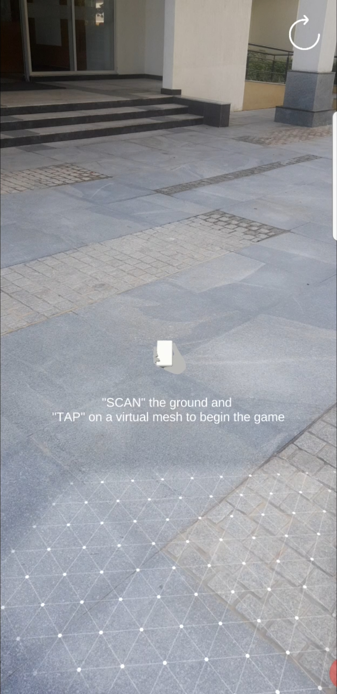
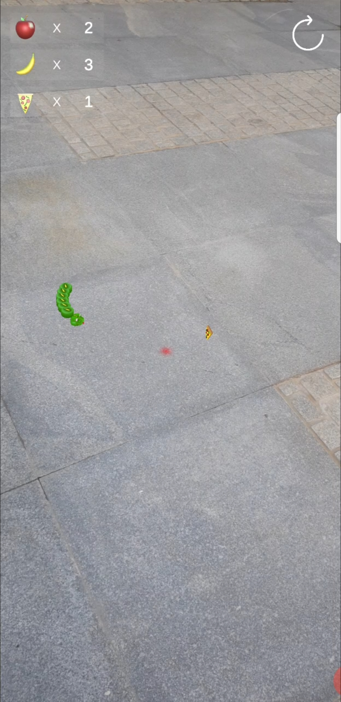
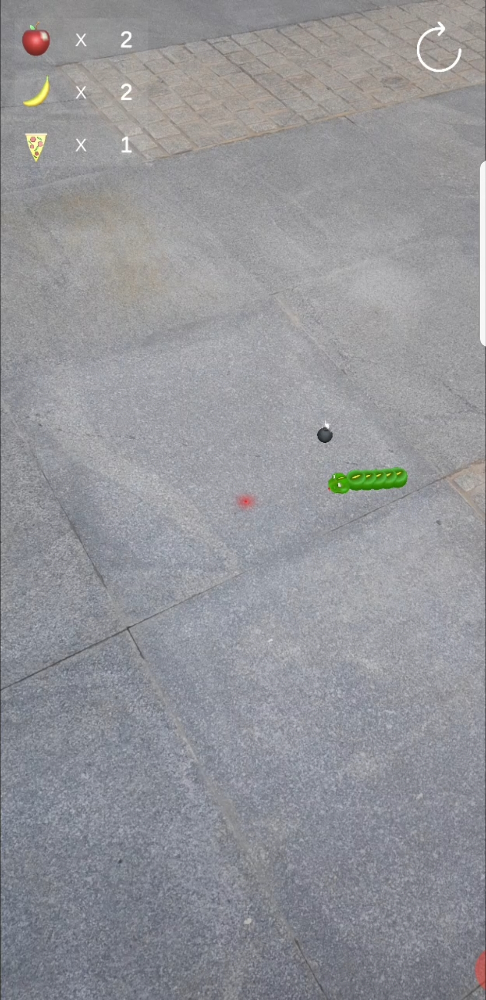
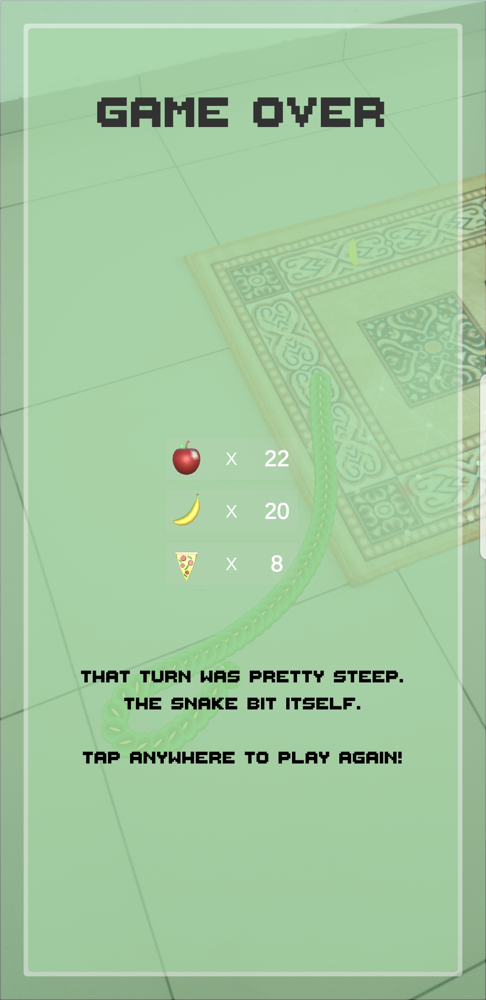

# Snake Snack
Get ready to indulge yourself in the fascinating world of augmented reality with the spatial version of the nostalgic Nokia snake game.

**Built in:** Unity 2019.4 LTS

**AR SDK:** Updated to AR Foundation v 4.0.8 (Previously, ARCore)

**Demo Video:** **[Link](https://youtu.be/qW1h1FNRdFY)**

## Screenshots:
       

## Background
Developing games is one the best ways to learn programming. Google's codelab [Introduction to ARCore in Unity](https://codelabs.developers.google.com/codelabs/arcore-intro/index.html?index=..%2F..index#0) is a testament to that when it comes to designing and developing for augmented reality. Sadly, the exercise is no longer maintained and there are bugs which can be hard to overcome for someone new to Unity. This project is an upgraded version of the project and introduces a better architecture, UI enhancements and other game elements to make it a production ready AR app which anyone with an [ARCore compatible device](https://developers.google.com/ar/discover/supported-devices) can install and enjoy. Further, the project is completely open-source for AR enthusiats to learn the ropes and become a proficient AR developer. :v:

[Available for download on Android Play Store](https://play.google.com/store/apps/details?id=com.cosmoreal.snakepet)

## Feature Highlight
* Uses plane detection and tracking made available with ARCore
* Raycasting for interacting with the Snake and the food items
* 3 food item choices: Apple, Banana, Pizza
* Bomb that detonates
* Beat your old record to set a new high score
* No internet connection required while playing the game

